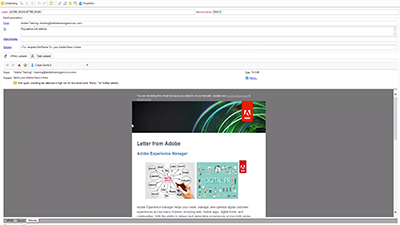

# Adobe Campaign Classic Tutorials - Overview 

Adobe Campaign provides a platform for designing cross-channel customer experiences and provides an environment for visual campaign orchestration, real time interaction management and cross channel execution. This user guide contains videos and tutorials on the many features and capabilities of Adobe Campaign Standard.

## What's New

* **[ Configure Push Channel using the Experience Platform Mobile SDK](/help/acc/sending-messages/mobile-channel/configure-push-using-aep-mobile-sdk )**
     
    *The Adobe Campaign Classic extension for the Adobe Experience Platform Mobile SDK allows you configure your mobile applications directly from Adobe Launch. (Campaign Classic release 19.1)*

* **[Control Panel](/help/acs/administrating/control-panel/control-panel-overview.md)**
     
    *The Control Panel allows Adobe Campaign administrators to easily monitor key assets as well as perform administrative tasks, like managing the SFTP storage by instance or whitelist IP addresses. (all versions)*

## Staff Picks

<table>
<tr>
  <td>
    
    

      <a href="">
    <strong>Workflow Heatmaps</strong>
    </a>
    

    

    <em>The Adobe Campaign Workflow provides a quick overview on the number of concurrent workflows.</em>
    

  </td>
   <td>
    
    

      <a href="#">
    <strong>Audit Trail</strong>
    </a>
    

    

    <em>Audit Trail captures, in real-time, a comprehensive list of actions and events occurring within Adobe Campaign.</em>
    

  </td>
  <td>
    
    

      <a href="./sending-messages/personalization-with-dynamic-content-blocks.md">
    <strong>Personalize emails using dynamic content blocks</strong>
    </a>
    

    

    <em>Personalize content or the appearance of messages and combine them with criteria from recipient profiles. </em>
    

  </td>
</tr>
</table>

## Additional Resources

* [Documentation](https://docs.adobe.com/content/help/en/campaign-learn/campaign-classic-tutorials/overview.html)
* [Adobe Campaign Standard Tutorials](/help/acs/overview.md)
