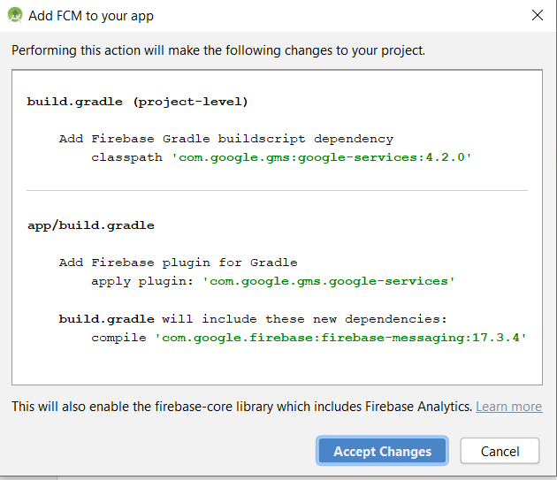
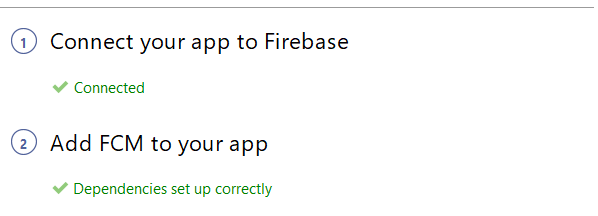

# Creating Android App and Configuring to use Firebase Cloud Messaging

In this part we will create Android App to receive push notifications sent from Adobe Campaign Standard.In order to receive the push notifications, app needs to be registered with Google's Firebase Cloud Service.

* Login to your Firebase account. Firebase is Google's mobile platform that helps you quickly develop high-quality apps. If you do not have Firebase account, please create one [from here](https://firebase.google.com).
* Launch Android Studio
* Click on File | New | New Project
* Select Empty Activity and click Next
 
* Provide a meaningful name to the project. For the purpose of this demo we have named our project as "ACSPushTutorial"
 
* Accept the default package names and click on Finish to create your project.
* Your project structure should look similar to the screen shot below
 
* Click on Tools | Firebase(This adds the project to Firebase)
* Click on Set up Firebase Cloud Messaging
 
* Click on **Connect to Firebase**
* After your app is connected to Firebase, click on **Add FCM to your app**
* When you are adding FCM to your app the wizard will need your permission to make some changes to your project.Click on **Accept Changes**
 
* On successful integration of your app with Firebase, you should get a message like shown below
 
* [Make sure your project is listed in Firebase console](https://console.firebase.google.com/)

## Configure Push Channel Settings

* Login to Firebase console
* Open the **ACSPushTutorial** project. Click on the gear icon and open the project settings 
 

* Tab to the **Cloud Messaging** tab. Copy the server key
 
* Login to your Adobe Campaign Standard instance
* Click on Adobe Campaign -> Administration->Channels->Mobile App
* Select the appropriate Mobile Application Property
* Click on the Android icon in the Push Channel settings section
* Paste the server key in the Server key field. Everything goes well you should see a SUCCESS message.

To summarize, we have created Android App and connected the Android App with Firebase. We then connected the Mobile App with the Android App by pasting the Android App's server key in to the Mobile App in Adobe Campaign Standard.
