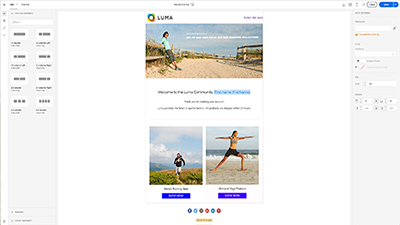
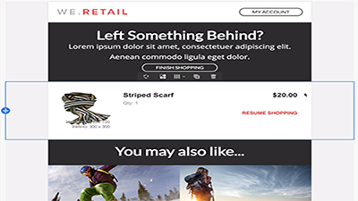

# Adobe Campaign Standard Tutorials - Overview 

Adobe Campaign provides a platform for designing cross-channel customer experiences and provides an environment for visual campaign orchestration, real time interaction management and cross channel execution. This user guide contains videos and tutorials on the many features and capabilities of Adobe Campaign Standard.

## What's new

* **[External API Activity (beta)](./managing-processes-and-data/external-api-activity.md)**
     
    *Learn how to easily integrate Adobe Campaign Standard into your technology ecosystem for real-time personalization.*
* **[External Signal Activity - Call a workflow with parameters](./managing-processes-and-data/external-signal-activity.md)**
   
    *Learn how to configure a workflow to be triggered externally and receive parameters.*
* **[Control Panel](./administrating/control-panel/control-panel-overview.md)**
   
    *Learn how to easily monitor key assets, as well as perform administrative tasks, such as SMPTP whitelisting, with the Control Panel.*

## Staff Picks

<table>
<tr>
  <td>
    
    

      <a href="./communication-channels/mobile/in-app-message.md">
    <strong>In-App Messaging (tutorial)</strong>
    </a>
    

    

    <em>In-App Messaging is a channel that allows you to display a message when the user is active within a mobile application.</em>
    

  </td>
   <td>
    
    

      <a href="./designing-content/email-designer/email-designer-overview.md">
    <strong>Email Designer (videos)</strong>
    </a>
    

    

    <em>The Email Designer enables the quick and effortless visual creation of individually personalized emails.</em>
    

  </td>
  <td>
    
    

      <a href="./designing-content/product-listings-in-transactional-email.md">
    <strong>Product Listings (tutorial)</strong>
    </a>
    

    

    <em>Create transactional emails with a list of products and offerings. </em>
    

  </td>
</tr>
</table>

## Additional Resources

* [Documentation](https://docs.adobe.com/content/help/en/campaign-standard/using/campaign-standard-home.html)
